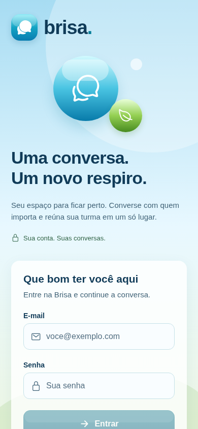
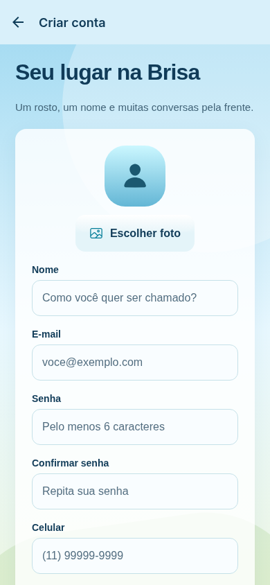
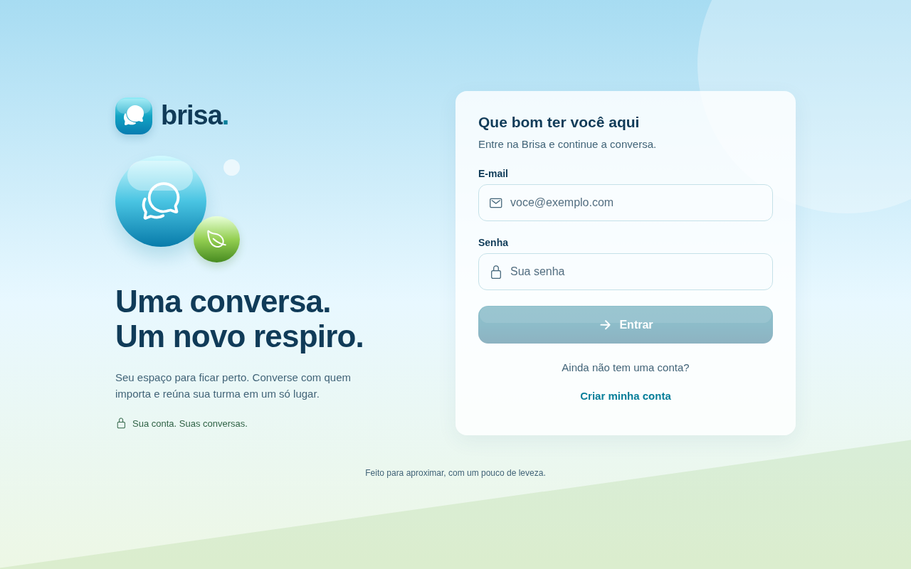
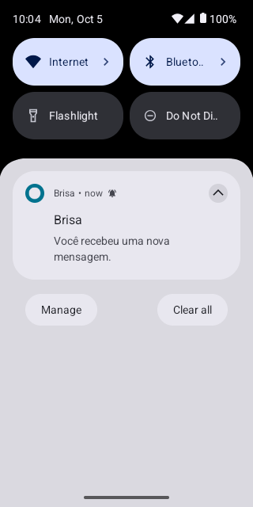
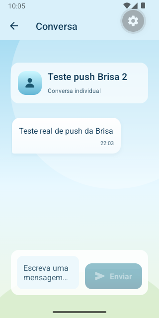

# Brisa

Chat individual e em grupo em React Native, com uma interface Frutiger Aero. Superfícies translúcidas, botões glossy, azul aqua e detalhes verdes acompanham conversas reais, autenticadas por e-mail e senha.

## Integrantes

- RM554962 — Guilherme Arendt
- RM554893 — Vitor Cesarino
- RM558216 — Fabricio Gomes
- RM555556 — Pedro Polido
- RM555447 — Matheus Hisamoto

## Estado da entrega

O aplicativo e a API estão implementados. A configuração real do SDK cliente foi copiada do projeto CP1 autorizado e está em `firebaseConfig.json`. Verificação TypeScript, testes de domínio e testes integrados com Firebase Emulator Suite estão disponíveis no repositório.

**A API está publicada, com health check HTTP 200. O development build Android recebeu um push FCM real em emulador Android 15 com Google Play; o toque abriu a conversa e a repetição do pedido retornou `duplicate`. As regras Firestore e Realtime Database foram publicadas. As 14 verificações da API sobre grupos e políticas passaram. Ainda faltam configuração/teste iOS, configuração/teste das fotos no Supabase e os demais cenários do roteiro de validação.** Não apresentar esta versão como entrega final ao professor antes desses passos.

URL pública da API: https://brisa-api-ral6.onrender.com. Verificação em 2026-10-05, após a criação do Firestore: `GET /health` respondeu HTTP 200 com `{"status":"ok","service":"brisa-api","firebase":"reachable"}`. Na verificação anterior, uma rota protegida sem token respondeu HTTP 401. As leituras nos dois bancos e um push real de conversa individual no Android foram confirmados. A equipe escolheu manter Render Free. Esse plano suspende o serviço após 15 minutos sem tráfego; a primeira requisição pode aguardar a inicialização. O aplicativo aguarda até 90 segundos por requisição. Isso reduz falhas durante a inicialização, mas não garante disponibilidade contínua durante a correção. Fonte: [Render Free](https://render.com/docs/free).

## Tecnologias

- Expo SDK 55.0.31, React Native 0.83.10 e React 19.2.
- TypeScript estrito, sem `any` no código do projeto.
- React Navigation com parâmetros tipados, React Hooks e componentes compartilhados.
- Firebase JS SDK para Authentication, Firestore e Realtime Database.
- Supabase Storage Free para fotos, com uploads autorizados pela API.
- React Native Firebase Messaging para tokens FCM e recebimento nativo Android/iOS.
- Expo Notifications para permissões e canal Android.
- `expo-font` 55.0.8 fixado para compatibilidade nativa com Expo 55; plugin local `plugins/withNotificationMetadata.js` resolve os metadados Android compartilhados por Expo Notifications e Firebase Messaging.
- Node.js 24, Express 5, Firebase Admin SDK, Zod, Helmet e rate limiting na API independente.

## Responsabilidade dos serviços

| Serviço | Responsabilidade |
| --- | --- |
| Authentication | Cadastro, login por e-mail/senha, sessão persistente e logout |
| Realtime Database | Mensagens individuais/grupo, listeners, trava e controle de acesso sincronizado |
| Cloud Firestore | Perfis, diretório reduzido, grupos, integrantes, limite, políticas, dispositivos e deduplicação de push |
| Supabase Storage | Arquivos das fotos de perfil/grupo; somente URL salva no Firestore |
| Firebase Cloud Messaging | Push nativo Android e iOS enviado pelo Admin SDK da API |

Não há Cloud Functions, contas simuladas, mensagens locais de demonstração ou envio administrativo pelo app. A API recebe a mensagem, grava no RTDB e retorna sua confirmação; depois o app solicita o push. Os listeners atualizam o chat sem refresh manual.

## Instalação

Pré-requisitos: Node.js 24, npm, conta Firebase e projeto EAS. Para testes integrados, Java 21 ou superior. Android exige SDK Android/dispositivo; iOS exige macOS/Xcode ou um build EAS instalado em aparelho físico.

```sh
npm ci
cp .env.example .env
```

Defina `EXPO_PUBLIC_API_URL` com a URL HTTPS publicada. Não coloque credenciais administrativas em variáveis `EXPO_PUBLIC_*`.

```sh
npm start
# Development build já instalado no dispositivo.
npm run android
# Build Android local com SDK configurado.
npm run ios
# Build iOS local no macOS.
npm run web
# Prévia da interface; push nativo não funciona na web.
```

## Firebase

1. Confira que `firebaseConfig.json` corresponde ao projeto desejado. Ele contém somente configuração pública do SDK cliente e deve permanecer versionado.
2. Habilite Authentication por e-mail/senha. O app e a API rejeitam uso de outros provedores no fluxo Brisa.
3. Crie Firestore e Realtime Database. Verifique a região/URL do RTDB no JSON. As fotos usam Supabase, conforme instruções abaixo.
4. Revise as regras deste repositório e as regras atualmente publicadas no projeto compartilhado com CP1. As regras RTDB locais de CP1 foram preservadas; Brisa usa um ramo separado.
5. Publique as regras revisadas com a CLI autenticada:

```sh
npx firebase deploy --only firestore:rules,firestore:indexes,database
```

Esse comando altera regras do projeto Firebase real. Não executá-lo sobre regras diferentes sem conciliar os caminhos usados por CP1. As regras do Firestore deste repositório são específicas desta aplicação.

O Firestore exige documentos de perfil criados pela API antes de permitir conversas. Se a conta foi criada e o envio do perfil falhou, o app recupera a sessão e oferece concluir o cadastro. Contas antigas de CP1 precisam completar o perfil Brisa.

## Fotos

Supabase Storage Free foi escolhido para evitar exigir faturamento no Firebase. O plano inclui 1 GB de arquivos, sujeito às cotas do serviço: [preços Supabase](https://supabase.com/pricing). O seletor solicita permissão da biblioteca e permite recortar uma imagem quadrada. A aplicação exibe avatar padrão quando não há foto ou ocorre erro de carregamento. Nenhuma imagem Base64 é gravada nos bancos.

1. Crie ou use um projeto Supabase no plano Free. Não é necessário ativar Firebase Storage.
   Projeto da equipe: `https://dcsiztcuyzxskugdydpf.supabase.co`. Configure essa URL como `SUPABASE_URL` no Render.
2. Execute [supabase/storage.sql](supabase/storage.sql) no SQL Editor. O bucket `brisa-photos` limita arquivos a JPEG/PNG/WebP e menos de 5 MB. Use um projeto sem políticas permissivas de escrita em `storage.objects`.
3. Em Render, defina `SUPABASE_URL` com a Project URL e `SUPABASE_SERVICE_ROLE_KEY` com a chave legada `service_role`, disponível em Settings > API Keys. A chave fica somente no servidor. Nunca usar a chave `anon` neste campo nem colocar a chave administrativa no aplicativo/GitHub.
4. Salve as variáveis e faça redeploy da API. Envie fotos pelo cadastro e pelo formulário de grupo para verificar a integração.

`POST /photos/uploads` valida o Firebase ID Token e devolve uma URL de upload assinada para `{uid}/{uuid}`. O servidor confere os limites do bucket antes de autorizar; o Supabase aplica os limites no upload real. A URL assinada expira em duas horas e não permite sobrescrever outro objeto. O aplicativo envia o arquivo diretamente ao Supabase e salva somente a URL pública final no Firestore. Fotos são públicas por URL; dados cadastrais continuam protegidos. Sem políticas de INSERT/UPDATE/DELETE públicas, clientes não podem gravar fora desse fluxo. Referência: [uploads assinados](https://supabase.com/docs/reference/javascript/file-buckets-createsigneduploadurl).

## Notificações Android e iOS

Push funcional exige **development build ou build nativo**, não Expo Go. A web mostra o fluxo e os estados, mas não registra token nativo FCM.

### Android

1. Cadastre um aplicativo Android no mesmo Firebase com package `com.brisa.chat`, ou ajuste o package em `app.config.ts`.
2. A configuração cliente Android `google-services.json` está versionada e corresponde a `com.brisa.chat` no projeto `cp1mobiles2`. Ao trocar de projeto, substitua este arquivo e `firebaseConfig.json`. Não coloque credenciais Admin nesses arquivos.
3. Habilite FCM v1 para o projeto e configure a conta do servidor com permissão de envio.
4. Gere/instale o development build. Android 13+ solicita permissão de notificações. O canal `messages` é criado antes de obter o token.

### iOS

1. Cadastre o bundle `com.brisa.chat` no mesmo Firebase ou ajuste o identificador no app config.
2. Coloque a configuração cliente `GoogleService-Info.plist` na raiz e forneça ao EAS.
3. Configure a chave APNs na aba Cloud Messaging do Firebase. Mantenha a chave `.p8` fora do repositório.
4. Configure assinatura Apple e entitlement de push no build. O app declara `aps-environment`, frameworks estáticos e modo remoto em `app.config.ts`.
5. Instale o development build no iPhone, permita notificações e verifique o token FCM. Não use token APNs diretamente no endpoint FCM.

```sh
npx eas-cli login
npx eas-cli build:configure
npx eas-cli build --profile development --platform android
npx eas-cli build --profile development --platform ios
```

Os arquivos nativos são de cliente, mas precisam corresponder ao Firebase de `firebaseConfig.json`. A API recebe token FCM nas duas plataformas. No foreground, há feedback dentro do app; no background/fechado, FCM apresenta a notificação do sistema. O toque abre a conversa, que ainda passa por verificação de participação. O perfil oferece nova tentativa de ativação caso permissão/token falhem.

### APK Android e build local

O APK de avaliação inclui JavaScript e configuração Firebase. Depois de instalado, não exige Metro, Expo Go ou computador da equipe ligado. Ele usa a API pública e os serviços Firebase.

Para gerar o mesmo APK, instale Node.js 24, JDK 17 e Android SDK com Platform 36, Build-Tools 36.0.0 e Platform-Tools. O Gradle instala NDK/CMake necessários.

```sh
npm ci
cp .env.example .env
export ANDROID_HOME="$HOME/Android/Sdk"
export JAVA_HOME="/caminho/do/jdk17"
npm run build:android
```

O arquivo gerado é `artifacts/brisa-android.apk`, para Android 7.0 ou superior, ARM64 e x86_64. O script usa dois workers para reduzir uso de memória. A assinatura local é a chave de desenvolvimento criada pelo prebuild; o APK serve para instalação direta e avaliação, sem publicação em loja. Para instalar por USB/emulador:

```sh
"$ANDROID_HOME/platform-tools/adb" install -r artifacts/brisa-android.apk
```

## API online

A API é independente e usa Node.js/Express. Admin SDK só existe em `server/`.

Variáveis necessárias, configuradas **somente nos segredos da hospedagem**:

- `FIREBASE_PROJECT_ID`
- `FIREBASE_DATABASE_URL`
- `FIREBASE_CLIENT_EMAIL`
- `FIREBASE_PRIVATE_KEY`, aceitando quebras de linha reais ou `\n`
- `ALLOWED_ORIGINS`, lista de origens web separadas por vírgula
- `PORT`, normalmente definido pelo provedor

`server/.env.example` contém somente marcadores. Não adicionar conta de serviço, arquivo de chave, senha ou token ao Git. Para desenvolvimento, a API pode usar emuladores com `FIREBASE_EMULATORS=true`, sem credenciais administrativas. O servidor de produção recusa variáveis de emulador quando esse modo está desligado.

### Publicar no Render

`render.yaml` prepara um serviço Node com plano que permanece ativo e health check. O deploy exige uma conta Render conectada ao GitHub; a criação de um plano pago deve ser autorizada pela equipe.

1. Envie o código ao GitHub.
2. No Render, crie um Blueprint a partir do repositório, ou Web Service com build `npm ci && npm run server:build` e start `npm run server:start`.
3. Configure as variáveis secretas no painel do serviço. Use uma conta de serviço com permissões necessárias para validar/revogar tokens Auth, ler/gravar Firestore e RTDB, e enviar FCM. Evite papel Owner/Editor do projeto.
4. Confirme a API publicada e copie a URL HTTPS para `EXPO_PUBLIC_API_URL` e a seção de estado deste README.
5. Confira `curl https://SUA-API/health`. Esse endpoint faz leitura real em Firestore/RTDB e responde 503 se o backend estiver indisponível.
6. Registre a URL real na entrega Teams e mantenha o serviço ativo durante a correção.

### Executar a API em desenvolvimento

```sh
npm run server:dev
npm run server:build
npm run server:start
```

No modo local sem emuladores, as variáveis administrativas precisam vir de um ambiente seguro. Não criar um arquivo de conta de serviço no repositório. Servidor local serve apenas para desenvolvimento; não atende à entrega do push.

### Endpoints

Todos, exceto `/health`, exigem `Authorization: Bearer <Firebase ID token>` de usuário autenticado por senha.

| Método/caminho | Operação |
| --- | --- |
| `GET /health` | Disponibilidade e conectividade Firebase |
| `PUT /users/me` | Salvar cadastro e diretório reduzido |
| `GET /users/:uid` | Perfil próprio ou de participante de conversa em comum |
| `POST /conversations/direct` | Criar/localizar par único; body `participantId` |
| `GET /conversations/:id` | Conferir participação e obter metadados |
| `POST /groups` | Criar grupo; body `id`, `group` |
| `POST /photos/uploads` | Autorizar upload Supabase; body `mimeType`, `size`; retorna `uploadUrl`, `photoUrl` |
| `PUT /groups/:id` | Editar integrantes/limite/política/foto; body `group`, `expectedVersion` |
| `POST /groups/:id/reconcile` | Concluir edição interrompida; somente proprietário |
| `POST /conversations/:id/messages` | Persistir mensagem validada; ID estável para retry |
| `POST /notifications/messages` | Push seguro; body `conversationId`, `messageId` |
| `PUT /devices/:id` | Registrar/atualizar token e plataforma próprios |
| `DELETE /devices/:id` | Desregistrar dispositivo no logout |

## Políticas de notificação

| Política | Destinatários de push |
| --- | --- |
| `all_group_messages` | Todos os integrantes exceto remetente para mensagem geral; selecionados para mensagem direcionada |
| `mentioned_members` | Somente integrantes mencionados/selecionados |
| `direct_messages_only` | Grupos não geram push; conversas individuais continuam notificando |
| `disabled` | Nenhum destinatário daquela conversa |

Mensagem direcionada continua visível no histórico do grupo. O seletor explícito “Para” no chat gera `target` e `mentionedUserIds`; texto livre com `@nome` não é interpretado automaticamente. A API exclui o remetente e terceiros, confere participação atual e nunca aceita destinatários fornecidos pelo cliente.

Uma reivindicação transacional por mensagem impede repetir submissões FCM. Uma falha incerta após essa reivindicação pode perder uma notificação; não há reenvio administrativo automático. Consulte [arquitetura](docs/architecture.md) para o custo dessa garantia, recuperação entre bancos e limites de escala.

## Dados e segurança

```text
Firestore
  users/{uid}                         perfil completo, leitura própria
    devices/{deviceId}                tokens privados, gerenciados pela API
  directory/{uid}                     somente nome, UID e URL da foto
  groups/{id}                         integrantes, limite, política, versão
  directConversations/{id}            dois participantes, par único
  notificationDeliveries/{id}/messages/{messageId} reivindicação de push, servidor apenas

Realtime Database
  brisa/conversations/{id}
    metadata                          metadados espelhados pelo servidor
    gate                              integrantes e fase ready/changing
    pending                           operação de grupo recuperável
    messages/{messageId}               mensagens persistidas

Supabase Storage
  brisa-photos/{uid}/{uuid}                  arquivo da foto
```

A transação RTDB fecha o acesso durante uma edição; a transação Firestore valida/grava a capacidade e metadados; uma transação final publica o acesso. O proprietário está incluído no limite e não pode ser removido. O limite é inteiro entre 2 e 100 e nunca pode ser menor que os integrantes selecionados. A versão esperada impede sobrescrever uma edição concorrente. Clientes não conseguem contornar isso escrevendo diretamente nos bancos.

Perfis de terceiros só são retornados pela API após conferir participação comum atual, incluindo o controle RTDB. Logout desmonta as telas protegidas e remove listeners. O histórico exibido usa as últimas 100 mensagens; não há paginação mais antiga nesta versão.

## Estrutura

```text
App.tsx                             navegação e notificações
src/components/                     componentes Aero e mensagem
src/screens/                        login, cadastro, conversas, usuários,
                                    grupo, chat, perfil, integrantes
src/contexts/                       sessão autenticada
src/hooks/                          conversas, usuários e chat realtime
src/services/                       Firebase, API, auth, fotos, grupos,
                                    mensagens e push nativo/web
src/types/                          navegação e declaração Firebase RN
shared/contracts.ts                 schemas e tipos derivados
server/src/                         Express, autenticação, conversas e FCM
scripts/inspect-web.mjs              inspeção reproduzível da interface
tests/                              testes de domínio e integração
```

`useState` controla formulários e estados; `useEffect` mantém e remove listeners; `useMemo` deriva filtros/diretórios/vagas; `useCallback` estabiliza recarga e ações de sessão. Dados externos são validados com Zod e erros são mostrados sem credenciais.

## Verificação

```sh
npm run verify
npm run test:integration
npx expo install --check
npx expo export --platform web
# Com a prévia web ativa e Chromium instalado em /usr/bin/chromium:
node scripts/inspect-web.mjs
```

Os testes integrados usam exclusivamente o projeto fictício `demo-brisa` em emuladores. Criam contas por senha e verificam concorrência, limites, acesso dos integrantes, remoção, perfis privados, bloqueio de escrita cliente, deduplicação do endpoint de push e recuperação de operação interrompida. Não enviam FCM real.

## Prints e evidência

As capturas abaixo são da interface React Native executada **na prévia web**, não de um aparelho Android/iOS. Não constituem evidência de push.





Teste nativo em 2026-10-05: duas contas temporárias por e-mail/senha, mensagem persistida no RTDB, destinatário em segundo plano, envio pela API publicada e recebimento via FCM no emulador Android 15 com Google Play. O toque abriu a conversa correta. A repetição de `POST /notifications/messages` retornou `{"status":"duplicate"}`.




Os 14 checks da API publicada validam gerenciamento de grupos, capacidade, concorrência, remoção e as quatro políticas de notificação. Confira [resultados](docs/live-api-checks.txt). O emulador Android também recebeu uma menção real de grupo. iOS permanece sem teste por decisão da equipe. Para o roteiro completo, siga [validação de entrega](docs/validation.md).

### Repetir os checks na API publicada

O script cria contas reais temporárias no Firebase; não usa usuários hardcoded no aplicativo. Ele exige Firebase CLI autenticado com acesso administrativo ao projeto somente para verificar tokens e limpar as próprias fixtures. Credenciais temporárias ficam em um arquivo local com permissão 0600, fora do repositório.

```sh
node scripts/verify-live-api.mjs --setup
# Entre no Android com a conta 0 do arquivo privado indicado e permita notificações.
node scripts/verify-live-api.mjs --verify
node scripts/verify-live-api.mjs --cleanup
```

Os resultados FCM do script confirmam aceitação pelo serviço, não exibição no dispositivo. Confira a bandeja Android e o toque na notificação separadamente. Não publique o arquivo temporário de credenciais.
